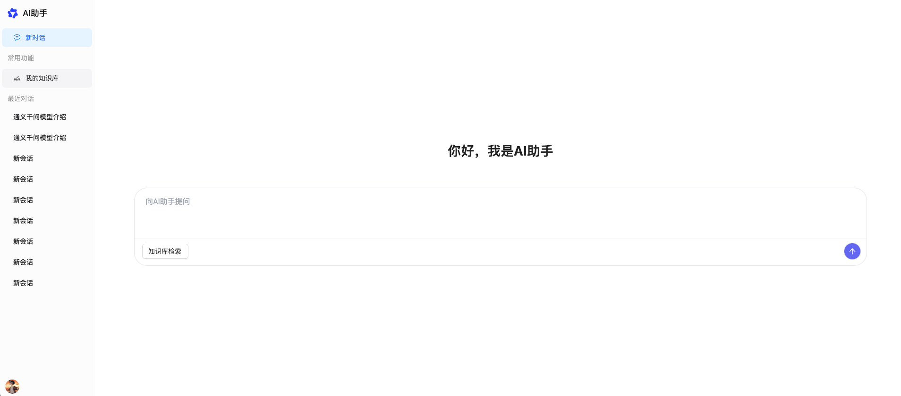
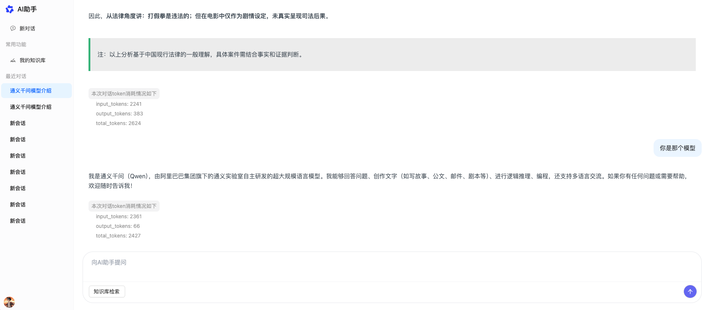
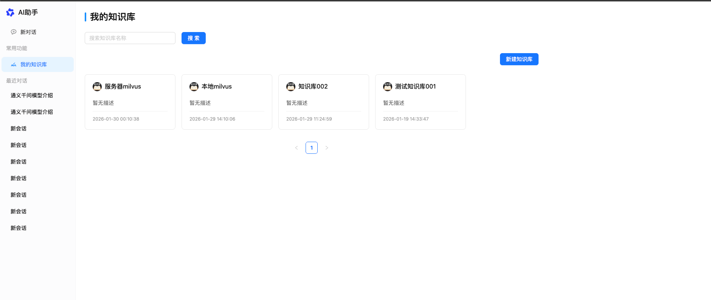
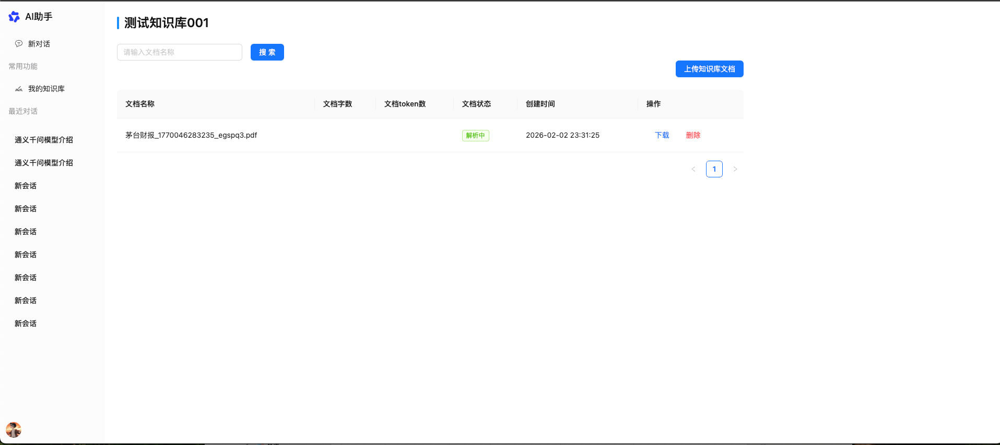

## 项目介绍
本项目为通用AI助手，目前只实现了单一的RAG检索能力，后续会逐步完善其他功能，如TextToSQL、智能客服等

## 技术栈描述
本项目采用前后端分离的技术架构，主要使用LangChain1.0进行编写，涵盖了多轮对话、历史记录、RAG检索能力等。并提供了会话管理、知识库管理、文档解析上传等功能

1. 后端主要技术栈：**Python3** + **LangChain 1.0** + **Flask** + **PostgreSQL** + **Milvus**
2. 前端主要技术栈：****Vue3** + **TypeScript** +  **Ant Design Vue** + **Axios** + **SSE**

---

## 项目预览

后端代码地址：
https://github.com/tianshiyang/assistant-backend-ai

前端代码地址：
https://github.com/tianshiyang/assistant-frontend-ai

## 后端技术栈概览

| 类别     | 技术 |
|----------|------|
| Web 框架 | Flask |
| AI / Agent | LangChain 1.0、LangGraph、通义千问 |
| 向量库   | Milvus（dense + BM25 混合检索） |
| 关系库   | PostgreSQL（业务数据 + LangGraph 会话 checkpoint） |
| 缓存 / 队列 | Redis（Celery broker、SSE 流式推送） |
| 异步任务 | Celery |
| 认证     | Flask-JWT-Extended |

---

## 主要功能

### 1. 账号与认证

- 用户注册、登录
- JWT 鉴权，获取当前用户信息

### 2. AI 对话

- **流式对话**： 
  支持选择技能（如知识库检索）、指定知识库 ID；任务由 Celery 执行，前端通过 **SSE** 拉取 Redis 中的流式结果。
- **会话管理**  
  - 获取当前用户所有会话  
  - 获取某会话下全部消息  
  - 删除会话  
- **会话标题**：根据首轮问答由 AI 生成并更新会话标题  
- **可能追问**：根据当前问答由 AI 生成若干条“用户可能问的问题”，用于前端推荐

### 3. 知识库（Dataset）

- 创建、更新、删除知识库
- 获取知识库列表与详情  
知识库用于对文档分组，并在对话时指定“在哪些知识库中检索”。

### 4. 文档与 RAG

- **文档上传**：支持用户自定义上传，并异步开启文档解析 
  解析文档（支持多种格式），切片后写入 **Milvus**（dense 向量 + BM25 稀疏），并落库元数据
- **文档列表与删除**：按条件查询已上传文档、按文档或知识库维度删除 Milvus 与元数据。

**RAG 流程**：

- 采用多智能体交互形式，父智能体通过调用被包装成工具的子智能体，来自主决断是否调用知识库检索智能体。并最终将检索结果或AI总结的经验告知给用户

## 环境与运行

- 依赖：见 `requirements.txt`（Python 3.x）。
- 环境变量：在项目根目录配置 `.env`，包含数据库、Redis、Milvus、Celery、JWT、通义千问等配置。
- 启动 Web：  
  `python app.py` 或通过 WSGI 启动 `app:app`。
- 启动 Celery Worker：  
  在项目根目录执行  
  `celery -A app:celery worker --loglevel=info`，以便执行 AI 对话、文档处理等任务。

- 启动Milvus：推荐利用docker进行Milvus的本地部署。[Milvus官方docker部署文档](https://milvus.io/docs/zh/install_standalone-docker.md)

- 文件存储：推荐使用与本项目相同的腾讯云oss存储，可在腾讯官网购买短期的oss存储服务
